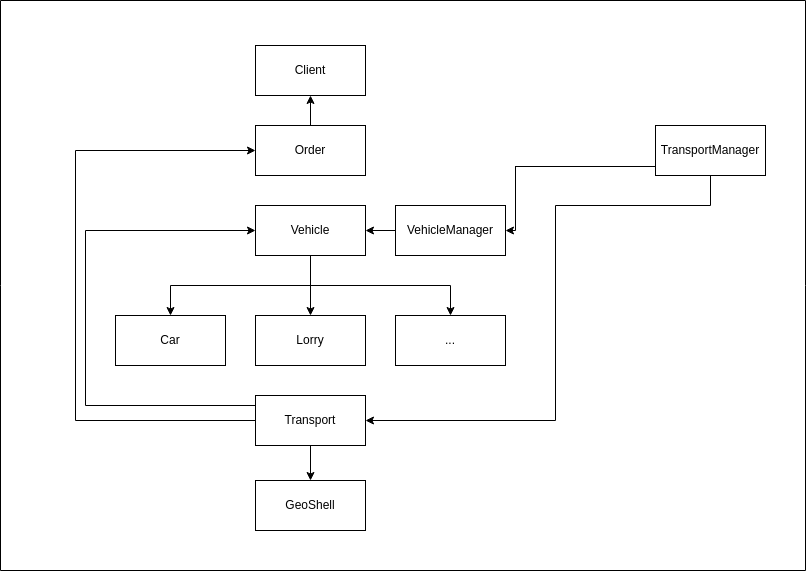

## Description
Baita Carga is a software system designed to **streamline transportation logistics management**. It features classes for Vehicles, Clients, Orders, and a TransportManager to handle operations efficiently. The system aims to optimize vehicle allocation and transport assignment, enhancing overall logistics operations.

## Understanding System's Architecture

The system's architecture revolves around fundamental classes like Vehicle, Client, and Order. Vehicle represents the transportation vehicle, Client represents the client requesting transportation, and Order represents the transportation order. Subclasses like Car, Lorry, and PickupTruck specialize Vehicle types. Intermediary classes like Transport link orders with vehicles, and management classes like Garage and TransportManager manage vehicles and transports, respectively. Utility functions like GeoShell provide geocoding functionality.

For more information, [click here](assets/docs/SystemArchitecture.md).

## Requirements:
The project currently only supports Linux environments with Curl/libcurl API pre-installed.

> **IMPORTANT!**
> The project does not support parallelization at this time.

Developed and maintained by [diogo2m](https://github.com/diogo2m).
