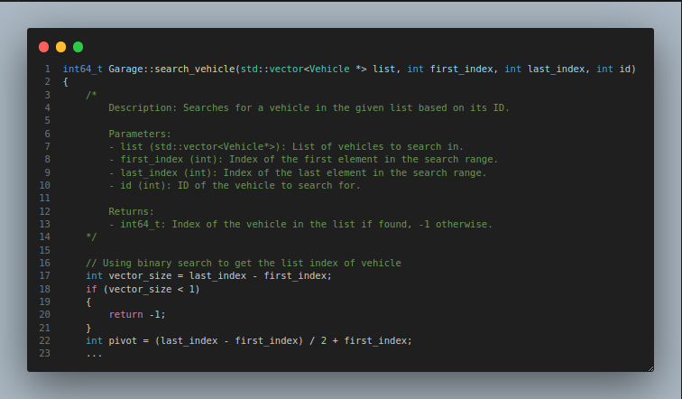

# Baita Carga

# 19/03/2024 - 01/04/2024

## Introdução ao projeto
Durante essa primeira sprint, o time de desenvolvimento foi introduzido ao problema apresentado pela transportadora (fictícia) Baita Carga. O produto a ser desenvolvido trata-se de um sistema de gerenciamento de entregas para a empresa. Baseado nos dados fornecidos, conseguimos construir alguns componentes básicos que o sistema deve possuir, dessa forma, podemos ter uma base para começar a desenvolver nossa aplicação.

## Implementação
A partir do que foi fornecido pela empresa, a equipe de desenvolvimento foi capaz de criar as classes básicas para operação da empresa: Automobile (e algumas classes-filho como: Car, Lorry e PickupTruck), Client e Order

## Próximos passos:
- Refatorar o código, corrigindo erros.
- Desenvolver novas features.

# 01/04/2024 - 08/04/2024

Durante essa sprint, a equipe exerceu duas atividades principais:
- Refatorar o código, corrigindo erros.
- Desenvolver as novas classes: VehicleManager.
 
## Refatoração do código
Durante essa sprint, a equipe percebeu que algumas classes possuíam erros arquiteturais de tipagem, nomenclatura, comportamento e organização de código. Dessa forma, algumas alterações foram feitas, visando melhorar a funcionalidade e legibilidade do produto. Dentre elas, podemos listar:
- Modularização de arquivos;
- Implementação de verificação de input nas funções Setters;
- Retorno de status quando uma função for executada;
- Uso de desconstrutor em todas as classes, desalocando memória;
- Status de atividade de cada veículo.

## Nova feature: Garage
Descrição: A classe Garage, serve para gerenciar os carros possuídos pela empresa. Com o novo atributo `active` na classe Vehicle, podemos ter um controle mais preciso dos transportes disponíveis para empresa. Além disso, alguns métodos foram implementados para facilitar o gerenciamento dos veículos. Tais como:
- Listar veículos;
- Listar veículos ativos;
- Buscar veículo por ID;
- Adicionar e remover veículos.

Próximos passos:
- Encontrar veículo mais próximo;
- Converter endereços para coordenadas.

# 08/04/2024 - 15/04/2024

Durante essa sprint, a equipe exerceu duas atividades principais:
- Refatorar o código, adaptando-o para um protótipo básico.
- Desenvolver as novas classes: GeoShell, Transport, TransportManager.

## Refatoração do código
Baseado nas necessidades solicitadas, foi necessário refatorar o código, realizando as seguintes modificações:
- Agora as classes originadas de `Vehicle` armazenam unicamente coordenadas geográficas para localização, já que a tendência é o veículo estar em movimento.
- Seguindo a lógica oposta, o `Client` agora recebe obrigatoriamente a localização em string (endereço).
- `Order`agora recebe o ID do transporte atrelado a ele.

## GeoShell
Baseado em uma ferramenta desenvolvida em Shell Script, o GeoShell atualmente possui apenas a função de converter endereços em coordenadas geográficas. Mas, como próximos passos, a equipe pretende evoluir o sub-projeto, adicionando novas features (e.g. converter coordenadas para um endereço aproximado).

## Transport
A classe Transport representa um transporte associado a um pedido e um veículo específico. Ela mantém informações como o ID do transporte, o ID do pedido, o ID do veículo, os endereços de coleta e entrega e o nome do destinatário.

## TransportManager

Descrição: O TransportManager é uma classe que gerencia o transporte de pedidos em uma empresa. Ele mantém uma lista de transportes, cada um associado a um pedido e a um veículo da frota da empresa. Além disso, o TransportManager está ligado a uma garagem onde os veículos são mantidos. Assim, facilitando operações relacionadas ao transporte, como criar novos transportes, encontrar o veículo disponível mais próximo de um determinado endereço, calcular distâncias entre coordenadas geográficas e listar os transportes associados a um pedido ou veículo específico.

Próximos passos:
- Converter coordenadas para endereço;
- Otimizar a alocação de transportes;
- Decrementar na capacidade de carga;
  

# 15/04/2024 - 22/04/2024

Durante essa sprint, a equipe exerceu duas atividades principais:
- Refatorar o código, buscando melhorar a legibilidade.
- Criar uma documentação para introduzir o funcionamento do software.

## Refatoração do código
Agora, todos os métodos possuem uma descrição de seu funcionamento, baseado no estilo Doxygen. Permitindo que o programador, ou o usuário, possam compreender rapidamente o funcionamento e o propósito do método. 

# 22/04/2024 - 29/04/2024

Durante essa sprint, a equipe exerceu as seguintes atividades principais:
- Refatorar o código, onde foi alterado o estilo de includes dos arquivos cabeçalhos e implementação
- Desenvolvida uma classe: EntryManager
- Nova pasta na árvore do sistema: input
- Foi adicionado um arquivo Makefile para agilizar e padronizar o processo de compilação do sistema

## Refatoração do código
Foi alterado o estilo de includes dos arquivos cabeçalhos e de implementação, foram adicionados atributos novos à classe cliente para estar compatível com o arquivo de entrada, foram alteradas algumas classes para permitir o uso de coordenadas com double ao invés de string

## EntryManager
A classe é responsável por ler arquivos de entrada e fazer o instanciamento das classes solicitadas, guardando-as em uma lista.

## input
Diretório onde serão guardados todos os arquivos de entrada

Próximos passos:
- Melhorar a arquitetura geral do sistema, criando novos métodos de controle.
- Estudo de uma politica de encaminhamento de entregas.

